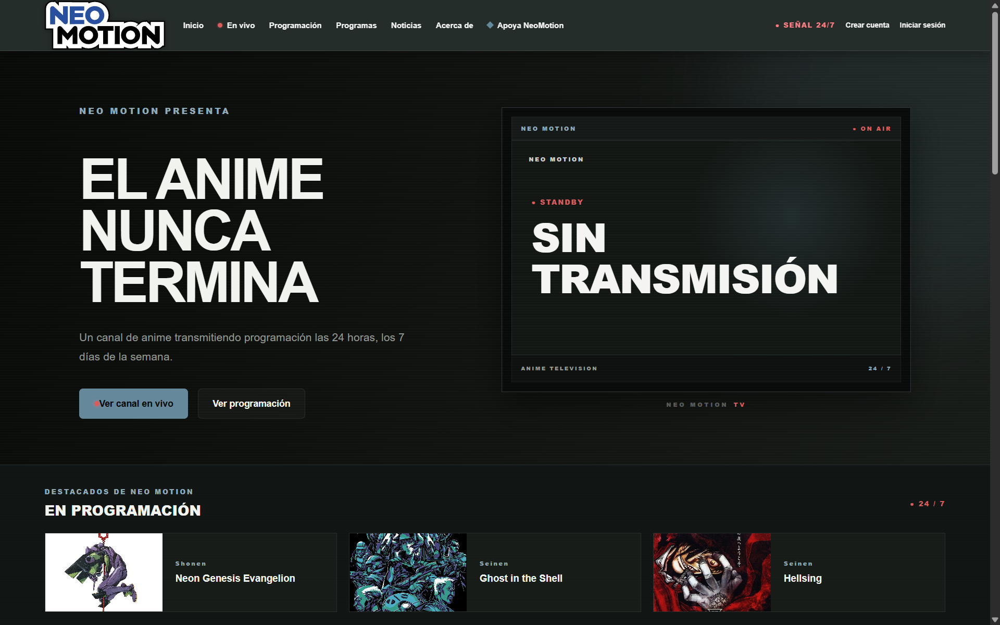
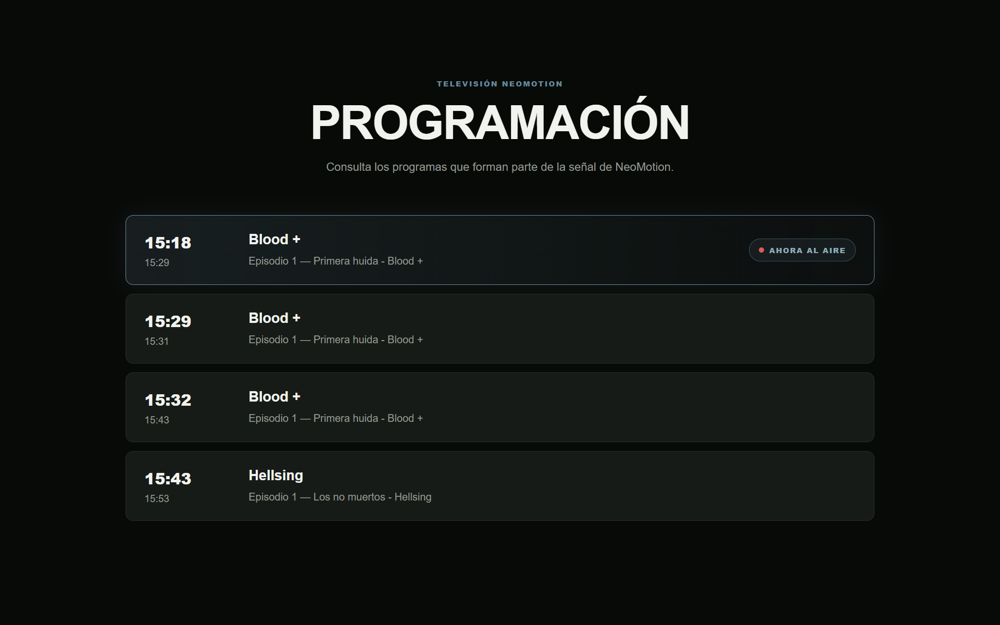
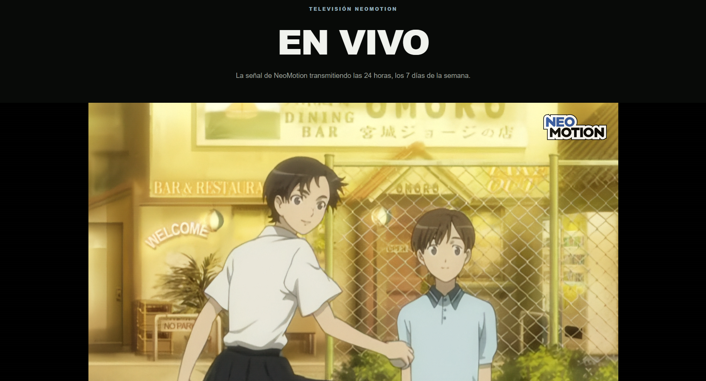
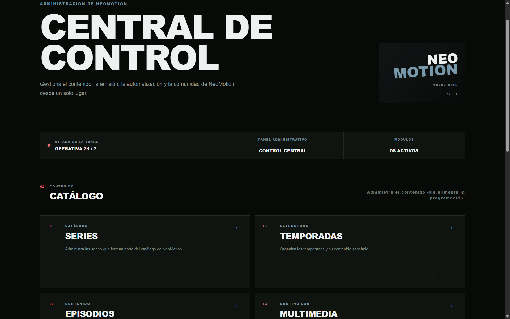

\# NeoMotion

NeoMotion es un proyecto personal que desarrollé con la idea de crear un canal de televisión de anime que funcione las 24 horas.

La idea nace de mi gusto por los antiguos canales de anime, especialmente de aquellos que tenían una programación continua, bloques de programación y una identidad propia.

No se trata de una plataforma con varios canales. NeoMotion representa un solo canal y todo el sistema está pensado alrededor de su programación.

\## Sobre el proyecto

El proyecto cuenta con un backend y un frontend separados dentro del mismo repositorio.

El backend se encarga de la lógica de la aplicación, la API, la autenticación, la gestión del contenido y la programación.

El frontend es la parte con la que interactúa el usuario y está desarrollado con React.

\## Estado del proyecto

NeoMotion es un proyecto terminado y funcional.

La idea es seguir mejorándolo con el tiempo, por lo que en el futuro podrían añadirse nuevas funciones, cambios o mejoras.

\## Funciones actuales

Entre las funciones que he ido desarrollando están:

\- Registro e inicio de sesión.

\- Autenticación mediante JWT.

\- Usuarios y perfiles.

\- Series.

\- Temporadas.

\- Episodios.

\- Contenido multimedia.

\- Categorías.

\- Favoritos.

\- Recomendaciones.

\- Noticias.

\- Programación.

\- Bloques de programación.

\- Panel de administración.

\- Reproducción de contenido.

\## Tecnologías

\### Backend

\- Java 21

\- Spring Boot

\- Spring Security

\- Spring Data JPA

\- Hibernate

\- JWT

\- Maven

\- PostgreSQL

\### Frontend

\- React

\- JavaScript

\- Vite

\- HTML

\- CSS

\### Herramientas

\- Git

\- GitHub

\- IntelliJ IDEA

\- Postman

## Capturas

### Página principal

### Programación

### En vivo

### Panel de administración

## Arquitectura

NeoMotion está separado en dos partes: un frontend desarrollado con React y un backend desarrollado con Spring Boot. Ambos se comunican mediante una API REST.

En el backend intenté mantener cada parte del sistema separada según la responsabilidad que tiene. Los controllers reciben las peticiones, los services manejan la lógica del sistema y los repositories se encargan de trabajar con PostgreSQL.

En general, el flujo es:

Frontend → API REST → Controllers → Services → Repositories → PostgreSQL

Para las imágenes y vídeos también existe un `StorageService`, que se encarga de guardar y eliminar los archivos en el sistema de archivos.

### Contenido

La información de anime está organizada de una forma bastante sencilla:

Series → Seasons → Episodes

Además de los episodios, NeoMotion tiene `MediaContent` para manejar otros elementos que forman parte del canal, como promos, comerciales y bumpers.

Los tipos de `MediaContent` que existen actualmente son:

- PROMO
- COMMERCIAL
- BUMPER
- OTHER

### Programación

Una de las partes principales del proyecto es la programación del canal.

Un `ProgrammingBlock` permite organizar varios contenidos en un orden determinado. Cada elemento del bloque puede ser un episodio o un contenido multimedia.

Después, esos elementos se utilizan para generar la programación real del canal mediante `Schedule`, que es donde se define cuándo se emite cada contenido.

En pocas palabras:

ProgrammingBlock → ProgrammingBlockItem → Episode / MediaContent → Schedule

Esto permite separar un bloque de contenido de la programación que finalmente ocupa un horario.

### Seguridad

NeoMotion utiliza Spring Security y JWT para controlar el acceso a la API.

Hay operaciones que pueden consultarse públicamente, mientras que otras, como administrar contenido o modificar la programación, requieren permisos de administrador.

Los usuarios también tienen un rol dentro del sistema y las contraseñas se almacenan utilizando un `PasswordEncoder`.

### Archivos multimedia

Los vídeos y las imágenes no se almacenan directamente en PostgreSQL. NeoMotion guarda los archivos en el sistema de archivos y mantiene sus rutas dentro de los registros correspondientes.

Esto permite que los episodios y contenidos multimedia tengan asociadas sus miniaturas y vídeos sin mezclar el almacenamiento de archivos con la información de la base de datos.

## Estado del proyecto

NeoMotion es un proyecto terminado y funcional.

La idea es seguir mejorándolo con el tiempo, por lo que en el futuro podrían añadirse nuevas funciones, cambios o mejoras.

